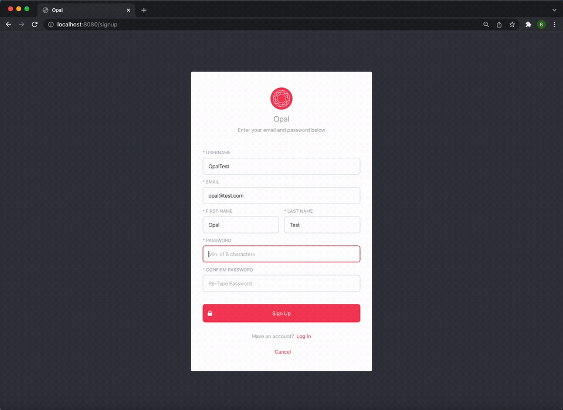
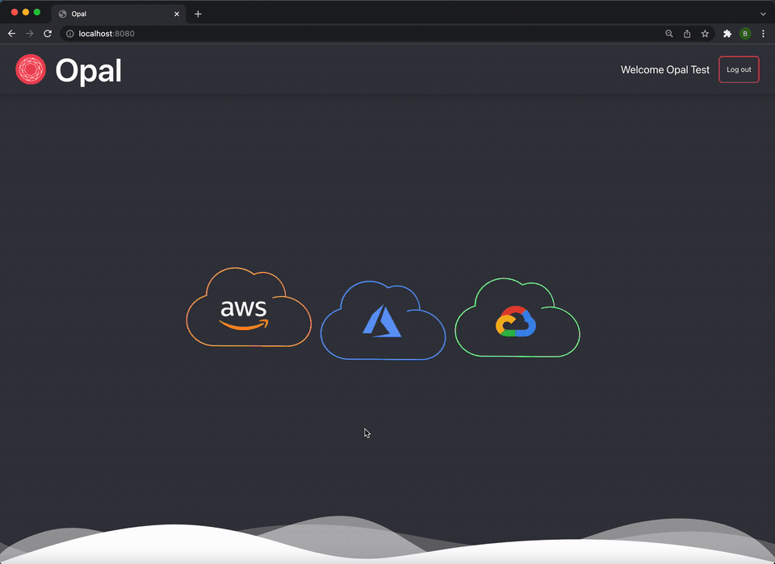
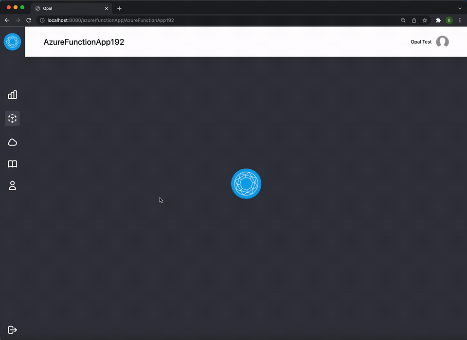
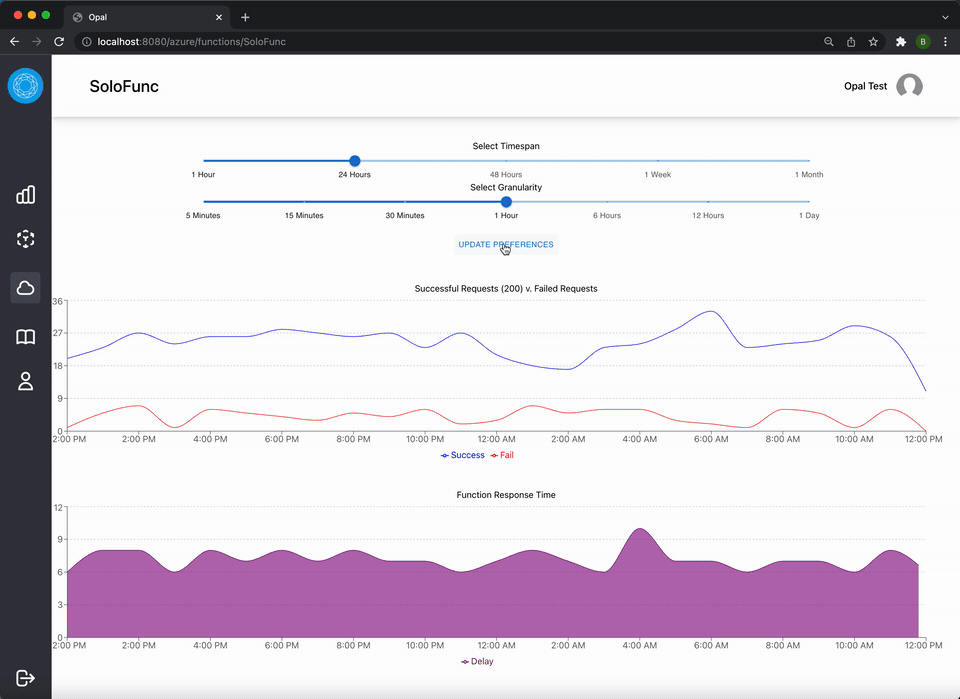

<p></p>

# Opal
An Azure Functions Monitoring Tool

# Table of Contents

- [About Opal](#about-opal)

- [Prerequisites](#prerequisites)

- [Getting Started](#getting-started)

- [Connecting to Azure](#connecting-to-azure)

- [Azure Account Access](#azure-account-access)

- [How to Use The App](#how-to-use-the-app)

- [FAQ](#faq)

- [Built With](#built-with)

- [Contributing](#contributing)

- [Authors](#authors)

- [License](#license)

## About Opal

Opal is a tool for monitoring Microsoft Azure Functions. Azure Functions are a leading "serverless" computing solution that allows developers to deploy code on-the-fly without the need to provision or maintain their own servers. Opal's code leverages a combination of Microsoft Azure JavaScript SDKs and REST APIs to query metrics associated with the user's Azure Functions, and visualizes those metrics through graphs rendered with the JS Recharts library.

Opal provides pre-configured, clean visualizations, permitting developers to efficiently analyze the current state of their Azure Function deployments without the learning curve or setup associated with the Azure Portal. Opal also permits users to programatically browse all Azure Function Apps and Functions with a single click.

Currently supported metrics in Opal include, among other things, function invocations, success and error rates, response times, and estimated billing from selected Azure Functions.

## Prerequisites

* [NodeJS](https://nodejs.org/en/)

* [NPM](https://www.npmjs.com/)

* An active [Azure subscription](https://azure.microsoft.com/en-us/free/) with deployed [Azure Functions](https://docs.microsoft.com/en-us/azure/azure-functions/functions-create-function-app-portal).

## Getting Started
<br />
<b>1. Clone this repo.</b>

If using [Git](https://git-scm.com/), run:
```
git clone https://github.com/oslabs-beta/Opal
cd Opal
```

<br />
<b>2. Install dependencies.</b>

```
npm install
```

<br />
<b>3. Build the app.</b>

```
npm run build-prod
```

<br />
<b>4. Authenticate.</b><br />

Be authenticated to an Azure account. (See 'Connecting to Azure' for more information.)

<br />
<b>5. Run the app.</b>

```
npm run start-prod
```


## Connecting to Azure

<b>1. Base Functionality</b>

If the user is already logged in to Azure through an existing authentication flow (e.g., Azure CLI, Azure PowerShell, Managed Identity, Environment Variables), Opal's base functionality is accessible out-of-the-box with no configuration. If not currently logged in, use the method you typically use to authenticate to Azure. For example, an Azure CLI user can type `az login`.

For more information about your options for authenticating to Azure, review the [DefaultAzureCredential docs](https://docs.microsoft.com/en-us/dotnet/api/azure.identity.defaultazurecredential?view=azure-dotnet).


<b>2. Additional Functionality</b>

Using Opal to access metrics on individual <em>functions</em> in a Function App requires sending a bearer token to Azure REST APIs. Opal will use HTTPS and OAUTH 2.0 to securely handle the token-generation process for you, as long as you place a .env file in Opal's root directory identifying a service principal that is authorized to access your Azure subscription.

```
AZURE_CLIENT_ID=<appId>
AZURE_CLIENT_SECRET=<password>
AZURE_TENANT_ID=<tenant>
```
If you do not already have a service principal, create one with the following command:

`az ad sp create-for-rbac --role contributor`

and use the output to create the above .env file.


## Azure Account Access

Opal accesses function metrics using Azure SDK's DefaultAzureCredential and Azure REST APIs. The DefaultAzureCredential supports [multiple authentication methods](https://docs.microsoft.com/en-us/dotnet/api/azure.identity.defaultazurecredential?view=azure-dotnet).

Opal does not interfere with the user's Azure deployment, does not write data to the user's Azure account, and does not store the data it reads from the user's Azure account.

Queries made through Opal utilize Azure SDKs and REST APIs, and may be subject to size or billing limitations imposed by the user's account. For more information, please refer to [Azure's Cost Management and Billing documentation](https://docs.microsoft.com/en-us/azure/cost-management-billing/) for the rules that may govern your subscription.


## How To Use The App

* <b>Login</b>

Create a login. After logging in, select the Azure icon (additional cloud providers will be added in a future patch).
<p></p>

* <b>Overview</b>

When the app renders, Opal displays graphs of the function execution count for every Function App in your tenant. This is the <b>"Overview."</b> From the Overview, you can see recent function execution count for every Function App in your tenant.
<p></p>

* <b>List View</b>

You can see a list of all of your Function Apps or functions by clicking "Function Apps" or "Functions" in the sidebar. You can click a specific Function App or function to navigate to the view for that Function App or function. A search bar is provided for ease of navigation.
<p></p>

* <b>Function App View</b>

You can access more detailed metrics in a specific Function App either by selecting that Function App on the <b>"Overview"</b> page, or selecting that Function App in the <b>"List View." </b>


To change the timespan and granularity, please use the corresponding sliders and click <b>"Update Preferences"</b>.
<p></p>

* <b>Function View</b>

You can access specific metrics for a function (i.e., the child of a FunctionApp) either by scrolling down in the corresponding "Function App View" and selecting that function, or by selecting that function from the "List View".

<p></p>

Timespan and granularity can be chosen in the Function View in the same was as above.

Due to Azure SDK limitations, the "List View" for functions and the "Function View" are only available if the user also adds service principal information to their .env.

## FAQ

<b>1. Why can't I see the functions from some of my subscriptions?</b><br /><br />

By default, service principals are associated with a single subscription. If you did not specify a subscription when creating your service principal (or specified only one), you may not be able to see functions from other subscriptions.

To fix this, create a new service principal, and then replace the data in your .env with data for a new service principal that has access to all of your subscriptions. First list all of your subscriptions with this Azure CLI command:

`az account list --query "[].{id:id}" --output tsv`

Then use the output of the above command to define scope when creating a service principal. For example, with three subscriptions, use the below command:

`az ad sp create-for-rbac --role contributor --scope subscriptions/<subscription1> subscriptions/<subscription2> subscriptions/<subscription3>`

Use the output of the above command to update your .env file according to the instructions in step 2 of [Connecting to Azure](#connecting-to-azure).

<br />
<b>2. What information do I need to provide to log in to Opal?</b><br /><br />

On initial login, users are prompted to select a name, username, email address, and password.

<br />
<b>3. What information will Opal store about me?</b><br /><br />

Only the information in Question #2. The user's password itself is not stored. Opal stores only a password hash.
<br />
<b>4. Does Opal maintain any information about my Azure account?</b><br /><br />

No. Opal stores no information about your Azure account. Opal simply acts as a client for a variety of Azure SDKs and endpoints to allow you to retrieve data from your Azure subscriptions in a single location.

<br />
<b>5. Do I need to enter to use my real email?</b><br /><br />

No. There are no consequences to creating a dummy email if you prefer not to be identified. But please avoid e-mail addresses that may legitimately be used by others.


## Built With

Opal was built with the following frameworks / libraries:

* Azure JavaScript SDKs

* Azure REST API

* Kusto Query Language (KQL)

* React

* React Router

* RechartJS

* Tailwind

* Framer Motion

* Redux

* TypeScript

* Express

* PostgreSQL


## Contributing

We welcome contributions to the project, and encourage submissions for any problems you encounter. To contribute, please fork the repo and submit a pull request to the dev branch.

Ideas for future developments and contributions include:

* Adding support for AWS Lambda or Google Cloud Functions, to make Opal a more platform-neutral serverless monitoring tool.
* Updating the Opal server as Microsoft continues to release updates to its Azure SDKs.
* Allowing for the display of additional metrics for Function Apps or functions.
* Adding custom dashboards for logged-in users.


## Authors
Alma Eyre [Github](https://github.com/aselunar) | [LinkedIn](https://www.linkedin.com/in/alma-eyre/) <br>
Marcel Palmer [Github](https://github.com/Marcelckp)<br>
Hussein Hamade [Github](https://github.com/hhamade98) | [LinkedIn](https://www.linkedin.com/in/hussein-hamade-/) <br>
Bill O'Connell [Github](https://github.com/wdoconnell) | [LinkedIn](https://www.linkedin.com/in/bill-o-connell-6b950177/) <br>

## License
Distributed under the [MIT License.](https://opensource.org/licenses/MIT)
