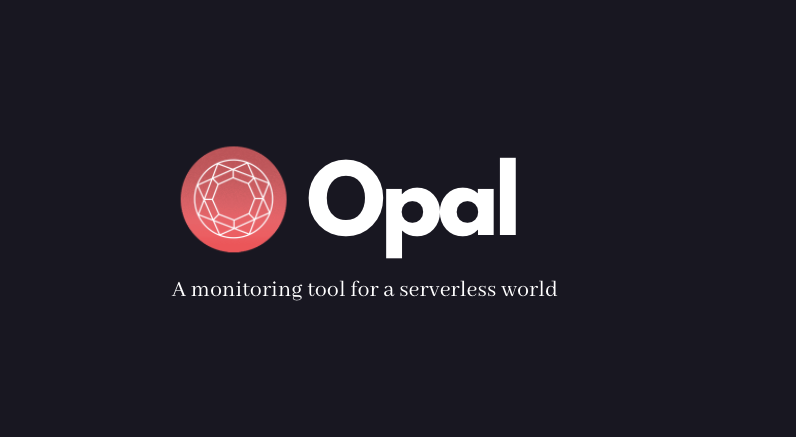

# Opal

# A Cloud Monitoring Tool

# Table of Contents

- [Features](#features)

- [Installation](#installation)

- [How It Works](#how-it-works)

- [Contributing](#contributing)

- [Authors](#authors)

## Features

A cloud monitoring tool focused on improving access to performance and financial metrics for Azure Functions.

## Installation

1. ``npm run start`` to initialize the client and dev server.

## How It Works

## Contributing

We'd love for you to test Opal out and submit any issues you encounter. Also feel free to fork to your own repo and submit pull requests!

## Authors
Alma Eyre
Marcel Palmer
Hussein Hamade
Bill O'Connell